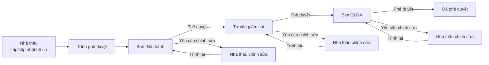

# Sơ đồ luồng phê duyệt online V2

Áp dụng cho: **RFA, RFI, Shopdrawing, Bản vẽ hoàn công**.

## 1. Luồng chính

## 2. Quy tắc xử lý

1. Nhà thầu là bên khởi tạo và trình hồ sơ.
2. Ban điều hành là cấp duyệt đầu tiên.
3. Khi một cấp chọn **Phê duyệt**, hồ sơ tự chuyển sang cấp kế tiếp.
4. Khi một cấp chọn **Yêu cầu chỉnh sửa**, bắt buộc phải nhập ý kiến.
5. Hồ sơ được trả về Nhà thầu để cập nhật nội dung/file.
6. Sau khi chỉnh sửa, hồ sơ **trình lại đúng cấp đã yêu cầu chỉnh sửa**, không chạy lại từ Ban điều hành nếu không cần.
7. Các cấp đã duyệt trước đó được giữ trạng thái đã duyệt.
8. Mọi thao tác được ghi vào lịch sử: người thao tác, thời điểm, cấp xử lý, hành động, ý kiến và lần chỉnh sửa.
9. Chỉ đúng người được chỉ định ở cấp đang chờ mới có quyền xử lý bước đó.
10. Khi Ban QLDA phê duyệt, quy trình chuyển sang **Đã phê duyệt** và đóng workflow.

## 3. Trạng thái chính

- `Đang duyệt - Ban điều hành`
- `Đang duyệt - Tư vấn giám sát`
- `Đang duyệt - Ban quản lý dự án`
- `Chờ Nhà thầu chỉnh sửa - <cấp trả hồ sơ>`
- `Trình lại - Đang duyệt - <cấp trả hồ sơ>`
- `Đã phê duyệt`

## 4. Lịch sử phê duyệt

Mỗi sự kiện lưu một bản ghi riêng:

- `SUBMIT`: Nhà thầu trình lần đầu.
- `APPROVE`: Cấp duyệt phê duyệt.
- `REQUEST_REVISION`: Cấp duyệt yêu cầu chỉnh sửa.
- `RESUBMIT`: Nhà thầu trình lại sau chỉnh sửa.
- `COMPLETE`: Quy trình hoàn tất.

Lịch sử không bị xóa khi trình lại.
